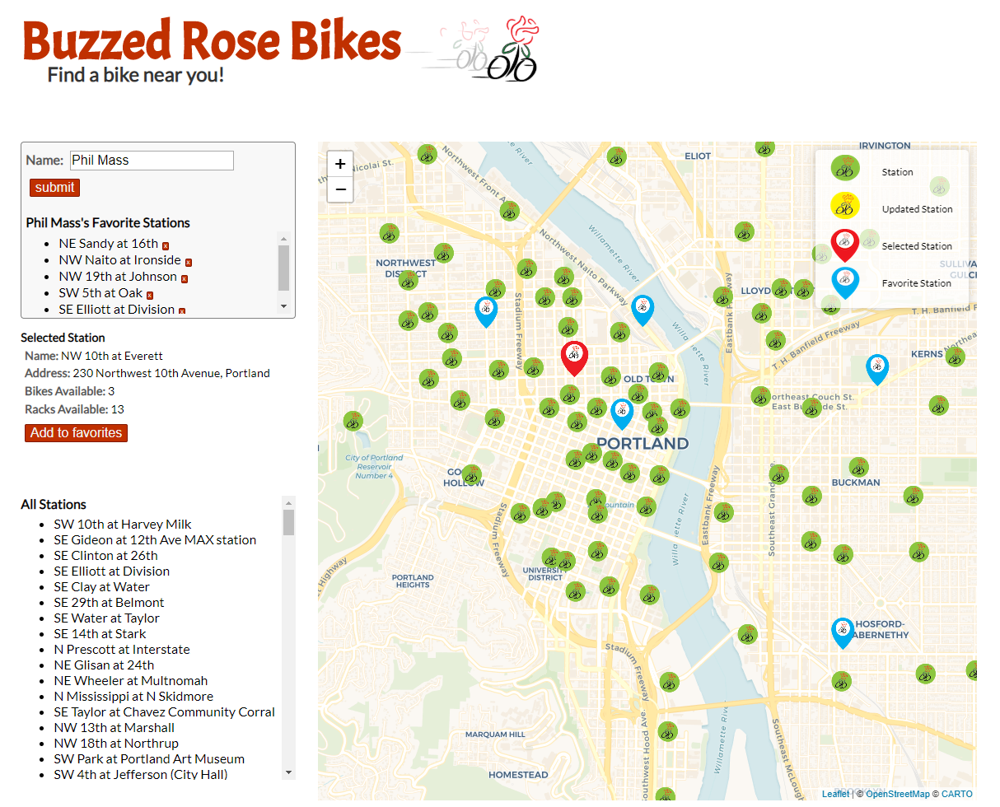

# Bike Share Map

#### By **Paige Williams, Tanvi Garg, Phil Mass, Victoria Martinez**

## Description

_This application shows the locations and current status of all of the Nike BIKETOWN bike share stations. It gets the locations and live bike status date from Nike's public API_

_You can view the deployed page [here](https://philrmass.github.io/bike-share-map)_

## Setup and Installation

* Clone the project from https://github.com/philrmass/bike-share-map.git to a local directory
* Open index.html in a browser

## Support and Contact Details

If you have any issues or questions, please email me at philrmass@gmail.com

## Technologies used

Created with JavaScript, jQuery, and the Leaflet map library

## Known Bugs
No known bugs.

## Legal

Copyright (c) 2018 Paige Williams, Tanvi Garg, Phil Mass, Victoria Martinez

Licensed under the MIT License
